# 基于springboot的健身房管理系统

---
### 👉作者QQ ：1556708905 微信：zheng0123Long (支持定制修改、部署调试、定制毕设)

### 👉接网站建设、小程序、H5、APP、各种系统等

---

#### 介绍

随着人们健康意识的不断提高，健身行业蓬勃发展。为了提高健身房的运营效率和服务质量，我们开发了这款基于 Spring Boot 的健身房管理系统。该系统旨在为健身房的管理者、员工和学员提供一个便捷、高效、集成化的管理和服务平台，实现健身房的数字化、智能化管理。

#### 技术栈

后端技术栈：Springboot+Mysql+Maven

前端技术栈：Vue+Html+Css+Javascript+ElementUI

开发工具：Idea+Vscode+Navicate

#### 系统功能介绍

（一）管理端  
个人中心：管理端用户可以在此查看和修改个人信息，接收系统重要通知和消息。  
会员管理：全面管理会员信息，包括会员的注册、个人资料、会员级别、会员状态（如正常、暂停、到期等）。可以对会员进行续费提醒、暂停或恢复会员资格等操作。  
员工管理：负责员工的招聘、入职、离职等流程管理。记录员工的基本信息、工作岗位、工作时间、薪资待遇等。可以对员工进行绩效评估、岗位调整和权限设置。  
会员卡管理：对会员卡进行发行、充值、挂失、补办等操作。可以设置不同类型会员卡的有效期、使用权限、优惠政策等。  
会员卡类型管理：创建和管理不同类型的会员卡，如月卡、季卡、年卡、至尊卡等。每种类型的会员卡可以设定不同的价格、服务内容和优惠条件。  
教练信息管理：对教练的个人信息、专业资质、教学经验、擅长项目等进行详细登记和管理。可以安排教练的课程和工作时间，对教练进行教学质量评估和反馈。  
解聘管理：处理员工的解聘相关事务，包括解聘原因记录、手续办理等。  
健身项目管理：创建、编辑和管理健身房提供的各种健身项目，如瑜伽、普拉提、动感单车、力量训练等。可以设置项目的课程安排、适合人群、难度级别等。  
指导项目管理：安排和管理针对会员的个性化指导项目，包括制定训练计划、饮食建议、跟踪会员的训练进度和效果等。  
健身器材管理：对健身房内的各种健身器材进行登记、维护记录、报废处理等管理。可以查看器材的使用频率、维修历史等信息，及时进行设备的更新和维护。  
健身活动管理：策划和组织健身房的各类活动，如健身比赛、会员聚会、公开课等。可以设置活动的时间、地点、参与人员、活动内容和奖品设置等。  

（二）学员端  
个人中心：学员可以在此修改个人资料，查看自己的健身记录和消费情况。  
会员管理：查看自己的会员信息，包括会员类型、有效期、剩余次数等。可以进行会员续费和升级操作。  
会员卡管理：管理自己的会员卡，如查看卡内余额、消费记录、充值记录等。  
教练信息管理：了解健身房教练的信息，选择适合自己的教练，并查看教练的课程安排和预约情况。  
健身项目管理：浏览健身房提供的各种健身项目，选择自己感兴趣的项目并查看课程详情和报名情况。  
健身器材管理：了解健身房内各种器材的使用方法和注意事项，查看器材的使用状态（是否可用）。  
健身活动管理：查看健身房举办的各类活动信息，报名参加自己感兴趣的活动。  

（三）员工端  
个人中心：员工可以在此更新个人信息，查看工作安排和绩效评估结果。  
会员卡管理：协助会员办理会员卡相关业务，如开卡、充值、查询等。  
教练信息管理：更新自己的教学信息，查看学员对自己的评价和反馈。  
健身项目管理：查看自己负责的健身项目的课程安排和学员报名情况。  
指导项目管理：为会员制定个性化的健身指导方案，跟踪指导项目的进展和效果。  
健身器材管理：检查健身器材的状态，上报需要维修或更换的器材。  
健身活动管理：协助组织和执行健身房的各类活动，如活动现场的布置、人员引导等。  

#### 系统作用

1.  提升管理效率     
为健身房管理者提供了全面、集中的管理工具，大大减少了繁琐的人工操作和数据处理工作，提高了管理决策的科学性和及时性。  
2. 优化会员服务  
学员端和员工端的功能设计，使得会员能够更方便地了解和参与健身项目，享受个性化的服务，同时也便于员工为会员提供更优质、高效的服务，增强会员的满意度和忠诚度。  
3. 资源合理配置  
通过对教练、器材、项目和活动的有效管理，实现了资源的合理分配和优化利用，避免了资源的闲置和浪费，提高了健身房的运营效益。  
4. 数据驱动决策  
系统能够收集和分析大量的运营数据，如会员消费行为、教练教学效果、项目受欢迎程度等，为健身房的发展策略制定和业务调整提供了有力的数据支持。  
5. 增强市场竞争力  
先进的管理系统有助于提升健身房的品牌形象和服务质量，吸引更多的潜在会员，在激烈的市场竞争中脱颖而出。  

#### 系统功能截图

代码结构

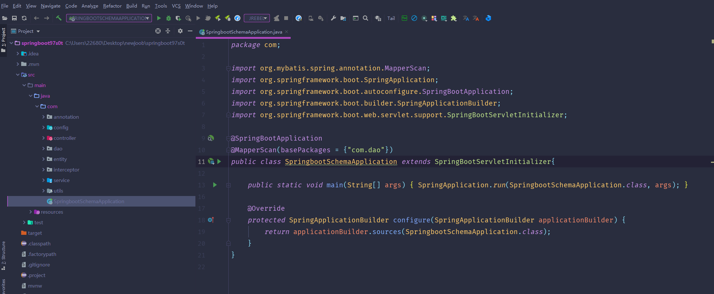

数据库表

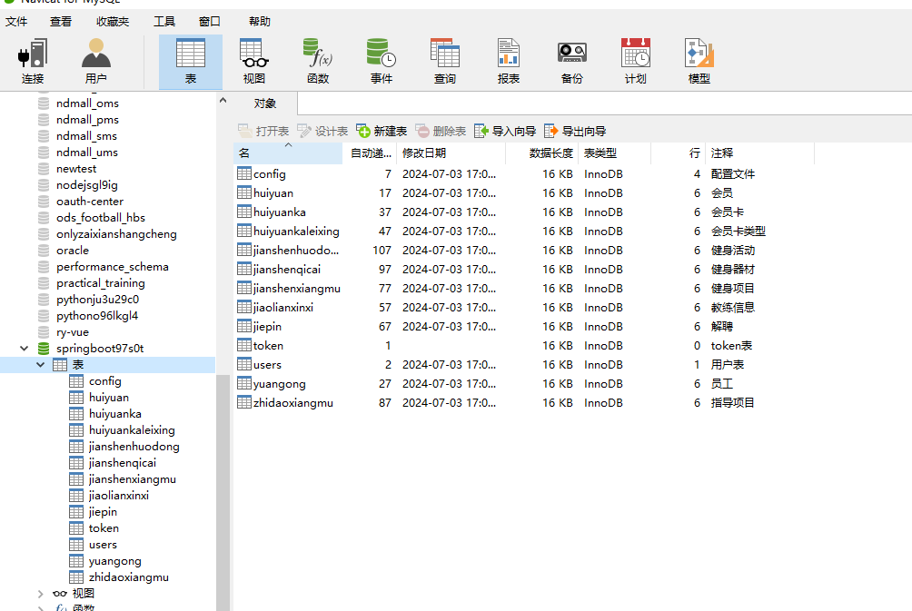

登录

会员管理

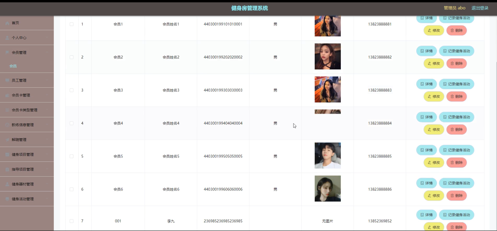

会员卡类型管理

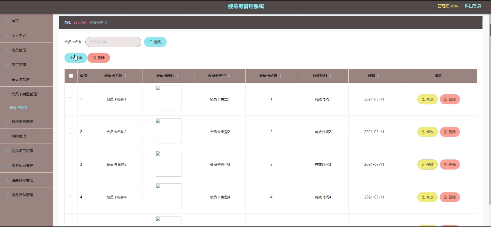

教练信息管理

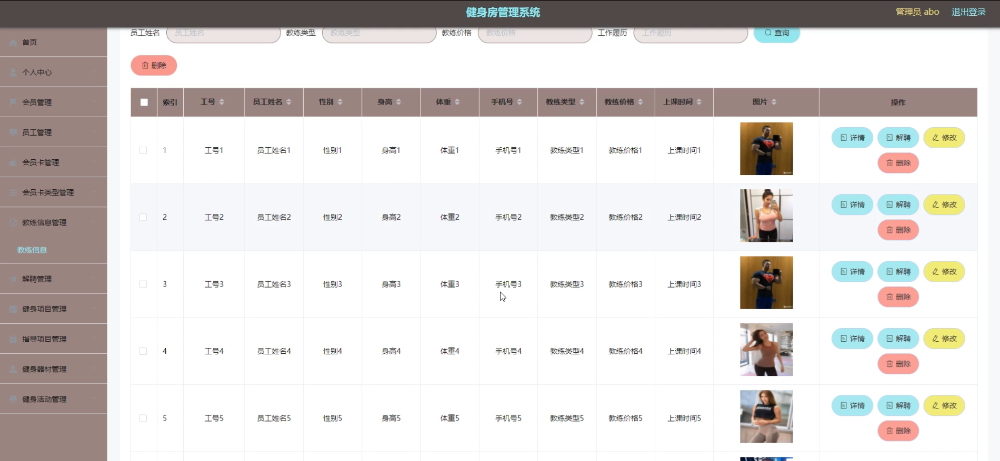

解聘管理

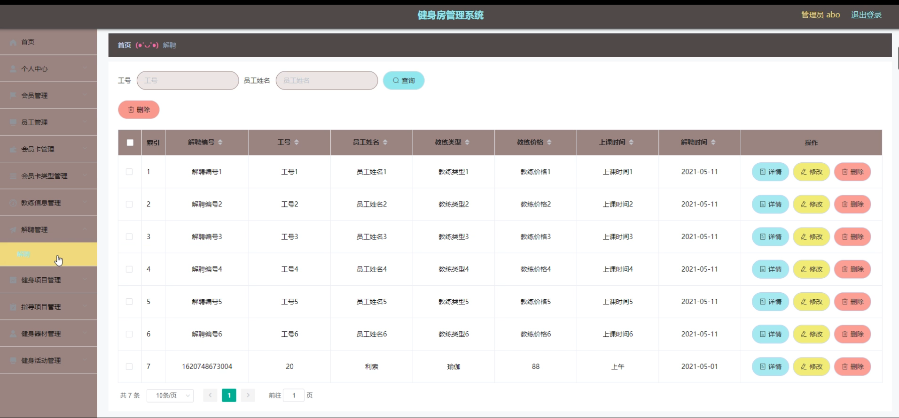

健身项目管理

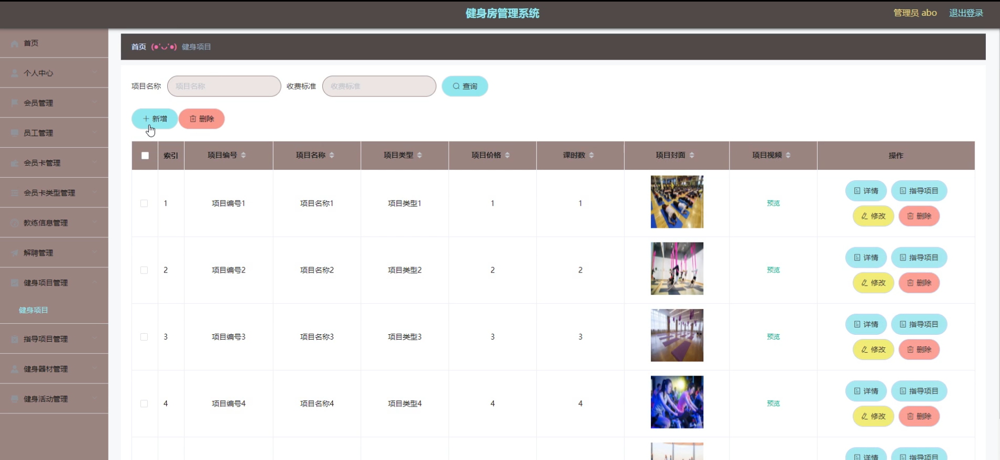

健身器材管理

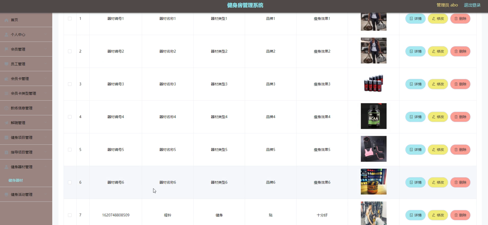

会员端会员信息

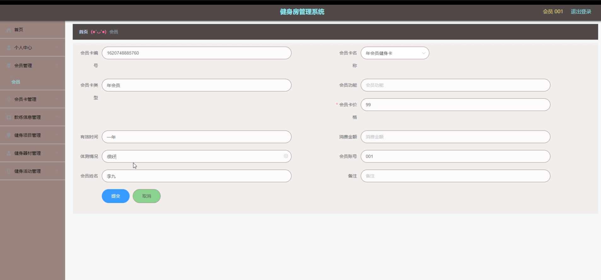

员工端信息

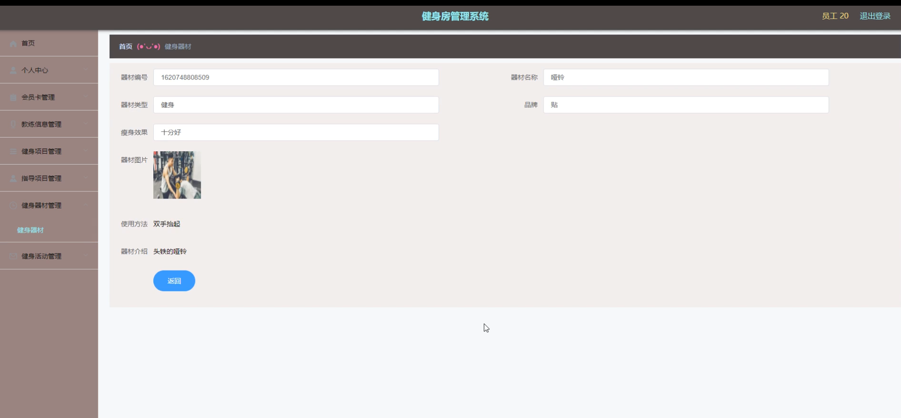

会员卡管理

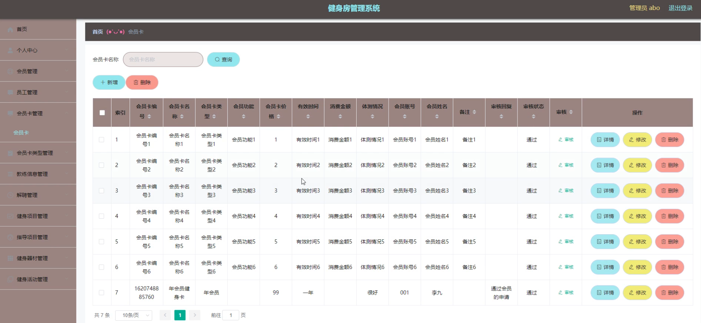

#### 总结

本基于 Spring Boot 的健身房管理系统，通过明确的角色分工和丰富实用的功能模块，实现了健身房管理的信息化、规范化和智能化。它不仅满足了健身房日常运营管理的需求，也为会员提供了更好的健身体验，为健身房的可持续发展奠定了坚实的基础。未来，我们将根据市场需求和技术发展，不断完善和优化系统功能，助力健身行业的蓬勃发展。

#### 使用说明

创建数据库，执行数据库脚本 修改jdbc数据库连接参数 下载安装maven依赖jar 启动idea中的springboot项目

后台地址
http://localhost:8080/springboot97s0t/admin/dist/index.html

管理员  abo 密码 abo